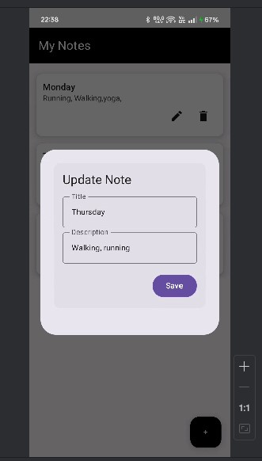

## 📸 Screenshots (Task 2)

### ➕ Add Note

### ✏️ Update Note

### 🗑 Delete Note

### 🔄 CRUD Operations Overview

https://github.com/user-attachments/assets/3c7e39d5-b233-488b-8fe0-82a22b2c2f9a

## How to Run
1. Clone the repository or download the project.
2. Open the project in **Android Studio**.
3. Allow **Gradle sync** to complete successfully.
4. Connect a physical Android device or start an emulator.
5. Click the **Run** button to launch the app.
6. Add, update, and delete notes to verify persistent storage using Room Database.

---

## How to Extend
- Implement **search functionality** to filter notes by title or content.
- Add **sorting options** (by date or title).
- Enable **dark mode support** using Material 3 theming.
- Add **cloud backup** using Firebase for cross-device sync.
- Implement **authentication** for user-specific notes.

